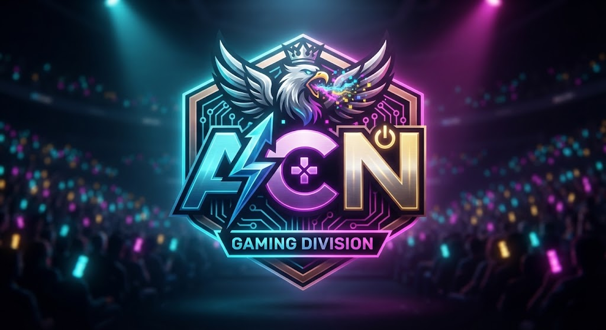
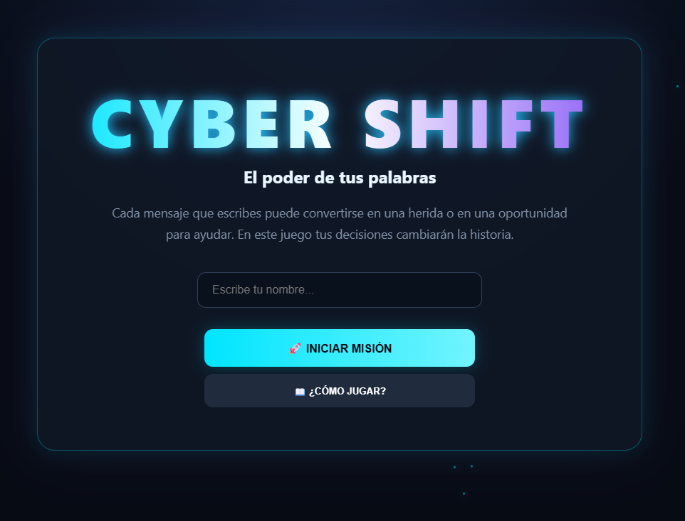
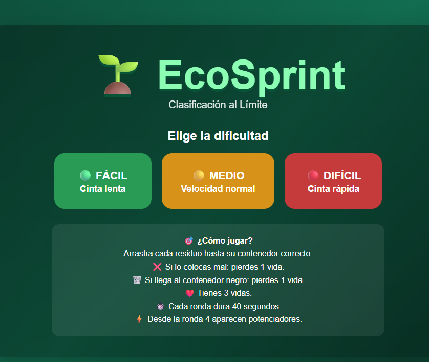
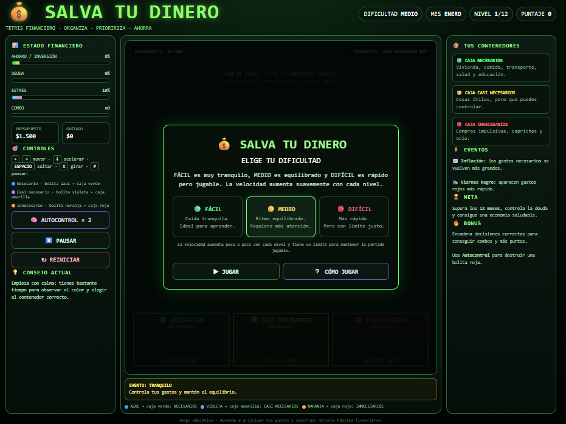
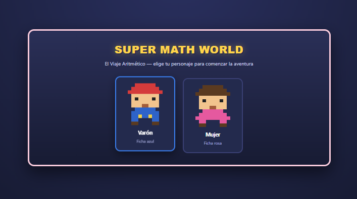
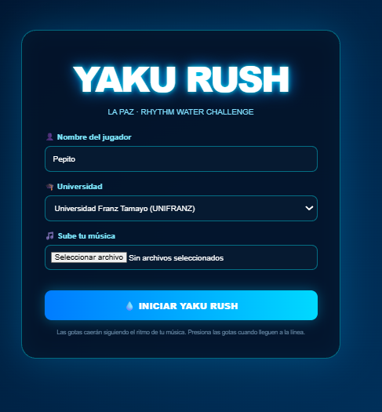
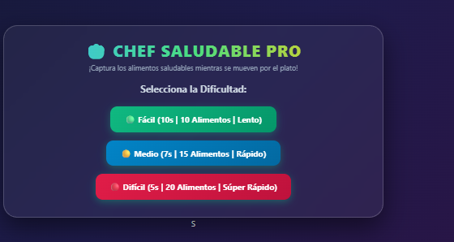

<!-- ===================================================== -->
<!--                  GAME DEV PORTFOLIO                   -->
<!-- ===================================================== -->

<div align="center">



<br>

# 🎮 ALEXANDER GAME DEVELOPMENT PORTFOLIO

### 🕹️ *Creando experiencias, aprendiendo código y convirtiendo ideas en videojuegos.*

<br>


<br>


</div>

---

# 🧭 MENÚ DEL PORTAFOLIO

| 🎮 Sección | 📌 Descripción |
|:--|:--|
| 👋 [Player Profile](#-player-profile) | Información sobre mí |
| ⚙️ [Skill Tree](#️-skill-tree) | Tecnologías y herramientas |
| 🕹️ [Game Library](#️-game-library) | Mis videojuegos |
| 🤖 [AI Assistance](#-ai-assistance) | Uso de Inteligencia Artificial |
| 🏆 [Unlocked Skills](#-unlocked-skills) | Lo que aprendí |
| 🚀 [Next Level](#-next-level) | Próximas mejoras |
| 👨‍💻 [Developer](#-developer) | Información del autor |

---

# 👋 PLAYER PROFILE

<div align="center">

> **PLAYER 01 — ALEXANDER CONDORI NINA**

🎓 Estudiante de Ingeniería de Sistemas  
💻 Desarrollador en formación  
🎮 Interesado en Game Development y experiencias interactivas

</div>

---

¡Hola! 👋

Soy **Alexander Condori Nina**, estudiante de Ingeniería de Sistemas y desarrollador en formación.

Me interesa combinar **programación, creatividad y diseño** para transformar ideas en experiencias interactivas.

Este repositorio reúne los videojuegos y prototipos desarrollados durante mis primeras experiencias en la asignatura de **Game Development**.

Cada proyecto representa un desafío diferente: desde la creación de mecánicas y sistemas interactivos hasta el diseño de interfaces, la resolución de problemas y la construcción de experiencias educativas.

> 🎯 **Mi objetivo:** desarrollar videojuegos que no solo sean entretenidos, sino que también puedan **enseñar, generar conciencia y transmitir ideas a través de la interacción**.

---

# ⚙️ SKILL TREE

<div align="center">

### 🧩 Tecnologías desbloqueadas durante el desarrollo

<br>


</div>

<br>

| Tecnología | Uso dentro de los proyectos |
|:--|:--|
| 🟠 **HTML5** | Estructura, pantallas y elementos interactivos |
| 🔵 **CSS3** | Diseño visual, animaciones e interfaces |
| 🟡 **JavaScript** | Lógica, eventos, mecánicas y sistemas de juego |
| 🔴 **Git** | Control y organización de versiones |
| ⚫ **GitHub** | Publicación y presentación del portafolio |

---

# 🕹️ GAME LIBRARY

<div align="center">

### 🎯 Selecciona una aventura

**6 videojuegos • 6 experiencias • múltiples desafíos**

</div>

---

## 🛡️ GAME 01 — CYBER SHIFT

<div align="center">



<br><br>


</div>

> 💬 **MISSION BRIEFING**

**Cyber Shift** es un videojuego interactivo enfocado en generar conciencia sobre el **ciberbullying**.

El jugador se enfrenta a diferentes situaciones digitales y debe tomar decisiones. Cada elección puede generar consecuencias y modificar el desarrollo de la experiencia.

🎯 **Objetivo:** reflexionar sobre el impacto de nuestras acciones y aprender a construir espacios digitales más seguros.

### 🎮 ACCESO

| | |
|:--|:--|
| 📂 **Proyecto** | 🔗 [Ver documentación](./juegos/CyberJuego/) |
| ▶️ **Juego** | 🎮 [Jugar Cyber Shift](./juegos/CyberJuego/index.html) |

---

## 🌱 GAME 02 — ECO SPRINT

<div align="center">



<br><br>


</div>

> 🌍 **MISSION BRIEFING**

**Eco Sprint** es un videojuego educativo centrado en el cuidado del medio ambiente.

El jugador deberá enfrentarse a diferentes desafíos mientras toma decisiones relacionadas con la protección del planeta.

🎯 **Objetivo:** demostrar que pequeñas acciones pueden contribuir al cuidado del medio ambiente.

### 🎮 ACCESO

| | |
|:--|:--|
| 📂 **Proyecto** | 🔗 [Ver documentación](./juegos/EcoSprint/) |
| ▶️ **Juego** | 🎮 [Jugar Eco Sprint](./juegos/EcoSprint/index.html) |

---

## 💰 GAME 03 — SALVA TU DINERO

<div align="center">



<br><br>


</div>

> 💸 **MISSION BRIEFING**

**Salva tu Dinero** es un videojuego educativo centrado en la administración responsable del dinero.

El jugador deberá enfrentarse a diferentes situaciones y decidir cómo utilizar sus recursos.

🎯 **Objetivo:** aprender conceptos básicos sobre ahorro, gastos y toma de decisiones financieras.

### 🎮 ACCESO

| | |
|:--|:--|
| 📂 **Proyecto** | 🔗 [Ver documentación](./juegos/Salva-tu-Dinero/) |
| ▶️ **Juego** | 🎮 [Jugar Salva tu Dinero](./juegos/Salva-tu-Dinero/index.html) |

---

## 🧮 GAME 04 — SUPER MATH WORLD

<div align="center">



<br><br>


</div>

> 🧠 **MISSION BRIEFING**

**Super Math World** combina desafíos matemáticos con mecánicas de videojuego.

El jugador debe resolver diferentes ejercicios para avanzar y superar los desafíos del mundo.

🎯 **Objetivo:** reforzar el razonamiento lógico y las habilidades matemáticas a través de una experiencia interactiva.

### 🎮 ACCESO

| | |
|:--|:--|
| 📂 **Proyecto** | 🔗 [Ver documentación](./juegos/Super-Math-world/) |
| ▶️ **Juego** | 🎮 [Jugar Super Math World](./juegos/Super-Math-world/index.html) |

---

## 💧 GAME 05 — YAKA RUSH AGUA

<div align="center">



<br><br>


</div>

> 🌊 **MISSION BRIEFING**

**Yaka Rush Agua** es una aventura interactiva enfocada en el cuidado y uso responsable del agua.

El jugador deberá superar desafíos relacionados con la protección de este recurso fundamental.

🎯 **Objetivo:** generar conciencia sobre la importancia del agua y promover acciones responsables.

### 🎮 ACCESO

| | |
|:--|:--|
| 📂 **Proyecto** | 🔗 [Ver documentación](./juegos/Yaka-Rush/) |
| ▶️ **Juego** | 🎮 [Jugar Yaka Rush Agua](./juegos/Yaka-Rush/index.html) |

---

## 👨‍🍳 GAME 06 — CHEF SALUDABLE

<div align="center">



<br><br>


</div>

> 🍎 **MISSION BRIEFING**

**Chef Saludable** es un videojuego educativo relacionado con la alimentación saludable.

El jugador interactúa con diferentes alimentos y deberá tomar decisiones para completar los desafíos.

🎯 **Objetivo:** promover la importancia de una alimentación equilibrada mediante una experiencia divertida e interactiva.

### 🎮 ACCESO

| | |
|:--|:--|
| 📂 **Proyecto** | 🔗 [Ver documentación](./juegos/Chef-Saludable/) |
| ▶️ **Juego** | 🎮 [Jugar Chef Saludable](./juegos/Chef-Saludable/index.html) |

---

# 🤖 AI ASSISTANCE

<div align="center">

### 🤖 Inteligencia Artificial como herramienta de apoyo

</div>

Durante el desarrollo de este portafolio y de los videojuegos, la **Inteligencia Artificial** fue utilizada como una herramienta de asistencia y apoyo creativo.

### 🔧 ÁREAS EN LAS QUE SE UTILIZÓ

- 💡 Generación y mejora de ideas.
- 🎮 Propuestas de mecánicas de juego.
- 💻 Apoyo en HTML, CSS y JavaScript.
- 🐛 Identificación y corrección de errores.
- 🎨 Sugerencias para interfaces y diseño visual.
- 🧩 Organización y mejora de la estructura del código.
- 🚀 Propuestas de nuevas funcionalidades.

> ⚠️ **Importante:** La IA fue utilizada como herramienta de apoyo. Los proyectos fueron integrados, probados, revisados y modificados durante el proceso de desarrollo.

---

# 🏆 UNLOCKED SKILLS

<div align="center">

### ⭐ Habilidades desbloqueadas durante esta aventura

</div>

```text
╔══════════════════════════════════════════════╗
║              ACHIEVEMENTS UNLOCKED           ║
╠══════════════════════════════════════════════╣
║ 🧩 Diseño de mecánicas interactivas          ║
║ 🎨 Creación de interfaces                    ║
║ 💻 HTML, CSS y JavaScript                    ║
║ ⚡ Manejo de eventos                          ║
║ 🏆 Sistemas de puntuación                    ║
║ 🎮 Diseño de experiencias educativas         ║
║ 🗂️ Organización de proyectos                 ║
║ 🔧 Resolución de errores                     ║
║ 🌐 Publicación de proyectos web              ║
║ 🐙 Uso de Git y GitHub                       ║
╚══════════════════════════════════════════════╝
```

---

# 🚀 NEXT LEVEL

<div align="center">

### 🔮 Próximas mejoras y desafíos

</div>

En futuras versiones de estos proyectos me gustaría desbloquear nuevas funcionalidades:

- [ ] 💾 Implementar sistemas de guardado.
- [ ] 🗺️ Crear nuevos niveles y mundos.
- [ ] 🎵 Incorporar música y efectos de sonido.
- [ ] ✨ Mejorar animaciones y efectos visuales.
- [ ] 🏆 Crear sistemas de logros.
- [ ] 📱 Optimizar los juegos para dispositivos móviles.
- [ ] 🎮 Agregar nuevas mecánicas.
- [ ] 🌐 Mejorar la publicación y accesibilidad de los proyectos.
- [ ] 🚀 Desarrollar nuevos videojuegos.

---

# 👨‍💻 DEVELOPER

<div align="center">

## 🎮 Alexander Condori Nina

### Estudiante de Ingeniería de Sistemas

**Game Development Portfolio**

<br>

*"Cada videojuego comienza con una idea.  
Cada línea de código ayuda a convertirla en una experiencia."*

<br>

⭐ **Explora los proyectos, juega, experimenta y descubre cada aventura.**

---

### 🎮 END OF PORTFOLIO

**THANKS FOR PLAYING! ❤️**

</div>